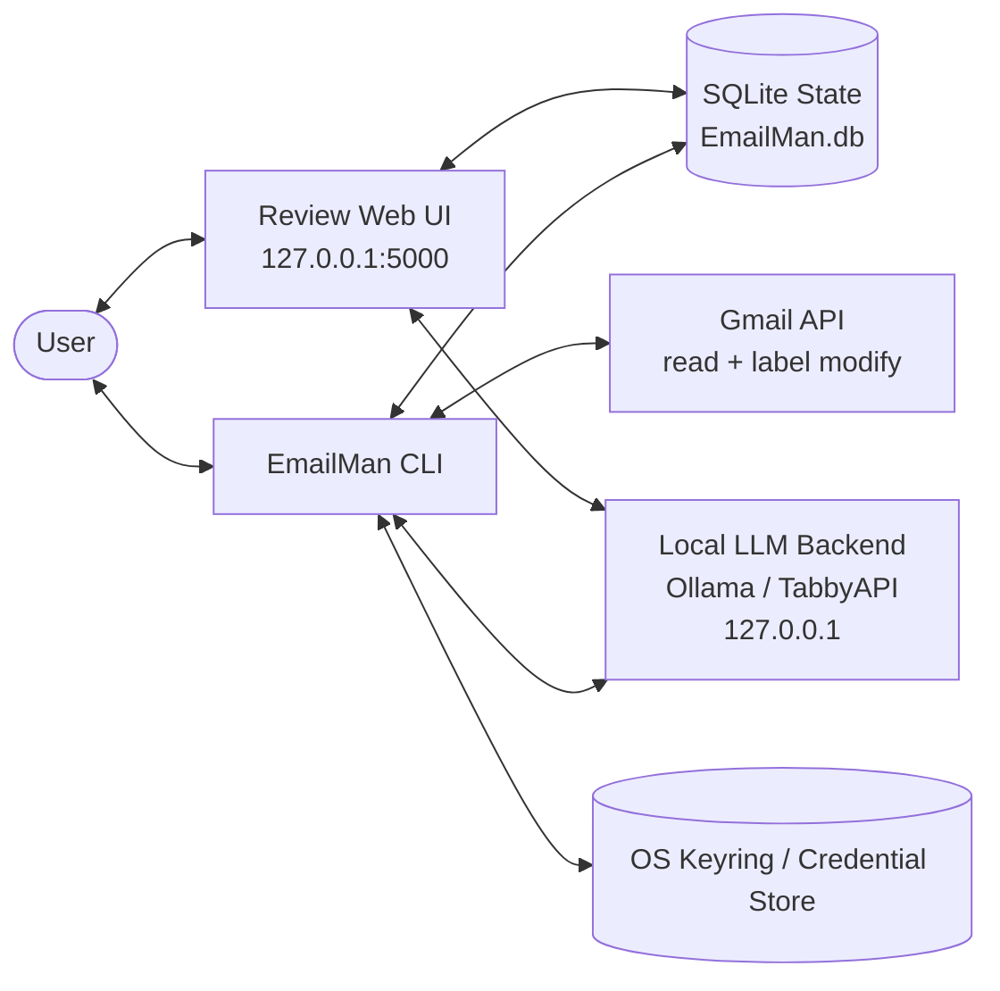

# EmailMan architecture

EmailMan is an installable Python application for suggesting, reviewing, and correcting labels for local mail (and, optionally, Gmail), then exporting decisions using local LLM inference. The default workflow needs no Gmail account or OAuth credentials. All inference runs on loopback (Ollama, TabbyAPI, OpenAI-compatible); Gmail access is strictly bounded to reading and label manipulation (no archive, delete, trash, spam, or send). Email bodies are treated as untrusted data with cryptographic nonce fencing, and review state is persisted locally in SQLite. The workflow supports offline evaluation, CSV/JSON export, and bidirectional label synchronization. See README for CLI usage and environment setup.

## 1. Introduction and goals

Help users categorize and organize email messages by proposing structured labels (categories, actions, retention) using locally hosted language models, with full human-in-the-loop review and correction before any changes reach Gmail.

Key architectural goals:
- **Mailbox preservation:** Zero destructive operations. Access is read-only except for label creation and applying/removing labels. Retention is an informational label, never an automatic deletion.
- **Local privacy:** Model inference runs strictly over local loopback interfaces with zero cloud fallback. OAuth refresh tokens are stored in the OS credential store. Email bodies are never sent to external AI providers or logged.
- **Human control:** Model proposals are strictly suggestions; human decisions are canonical. Human corrections persist across re-scans and re-classifications.
- **Resilient, low-footprint operation:** Single installable package, lightweight SQLite storage, fast review UI bound to loopback, and minimal core runtime dependencies.

## 2. Constraints

- Python 3.12+ package with minimal core dependencies (`flask`, `requests`) and an optional `[gmail]` extra.
- Local inference only: model endpoints must resolve to loopback (`127.0.0.1`, `localhost`, `::1`); non-loopback addresses and cloud endpoints are rejected.
- Gmail API access is limited to `gmail.modify` for label creation (`labels.create`) and message label manipulation (`messages.modify`). No code paths or scopes exist for archiving, deleting, trashing, or sending messages.
- Single active Gmail account per database in V1; accidental account mixing is refused.
- Untrusted data containment: email bodies are rendered strictly as text (no `innerHTML`, remote `src`, or script execution) and fenced with per-call cryptographic nonces in prompts.
- Protected test discipline: once a test exists, it cannot be modified without prior user approval; new tests for authorized features are added alongside protected baselines.
- GitHub issues and pull requests are the single source of truth for feature specifications and delivery evidence.

## 3. Context and scope

The user runs EmailMan on their local machine (Linux, macOS, or Windows).

### External Interfaces
- **Gmail API:** Reads message headers and bodies via `messages.get`, queries message lists via `messages.list`, creates labels via `labels.create`, and modifies message labels via `messages.modify`.
- **Local Model Backend:** Ollama (`http://127.0.0.1:11434`), TabbyAPI, or generic OpenAI-compatible endpoints on loopback.
- **Local Storage:** SQLite database (`EmailMan.db`) and OS credential store (`keyring`).
- **Web Browser:** User connects via loopback (`http://127.0.0.1:5000`) for the review interface.

### Scope Boundaries
- **In scope:** Bounded message ingestion, safe plain text extraction, local classification, web review UI, CSV/JSON export, dry-run label preview, opt-in Gmail label apply and sync.
- **Outside scope / Deferred:** Automatic message deletion/archival, background cron/schedulers, cloud LLM fallback, multi-tenant databases.

## 4. Solution strategy

- **Decoupled modules:** Separate ingestion, persistence, classification, security, web UI, and CLI.
- **Local-first design, Gmail optional:** The default path is ingest local `.eml` files, classify locally, review/correct in the loopback UI, and export — with no Gmail account or OAuth credentials required. All decisions, proposals, and label catalogs reside in SQLite; Gmail read/scan and label writes are an explicit, opt-in auxiliary step (`auth`/`scan` to pull mail, `apply-labels --apply` to write). The review UI exposes no Gmail write controls.
- **Nonce fencing & prompt engineering:** Untrusted email text is fenced with a cryptographic nonce (`secrets.token_hex(8)`) so prompt injections inside email bodies cannot escape the data block.
- **Structured outputs:** Structured JSON schemas (Ollama `format: PROPOSAL_JSON_SCHEMA` and JSON mode fallback) enforce deterministic outputs with label IDs, reasons, and abstain flags.
- **Bounded data retention:** 7-day auto-expiry for cached email bodies in SQLite; exports exclude email bodies and reasons.
- **Additive database migrations:** Lightweight SQLite schema upgrades without third-party migration frameworks.

## 5. Building block view

| Responsibility | Boundary |
| --- | --- |
| CLI (`EmailMan.cli`) | User commands (`auth`, `scan`, `ingest`, `classify`, `review`, `export`, `apply-labels`, `sync-labels`, `doctor`, `create-config`), argument parsing, exit codes. |
| Web Review UI (`EmailMan.routes`, `EmailMan.templates`) | Loopback Flask app, server-rendered HTML template, JSON APIs for review/decisions/conflicts and label-definition edits, CSRF and Host validation. |
| Classification Engine (`EmailMan.classification`) | Local inference clients (Ollama, Tabby, OpenAI-compatible), endpoint auto-detection, nonce prompt construction, JSON output parsing, validation. |
| Standalone Classification API (`EmailMan.classifier`) | High-level `EmailClassifier` facade over the classification engine; direct CLI (`--text`/`--file`/`--stdin`) and stateless `POST /api/classify` payloads with no database or Gmail dependency. |
| Local Ingestion (`EmailMan.ingest`) | Recursive RFC 822 `.eml` parser, inert MIME extraction, deterministic message identification, batch SQLite ingestion without Gmail credentials. |
| Local Persistence (`EmailMan.db`) | SQLite schema management (v1-v6), atomic transactions, WAL mode, decoupled message upserts, proposal tracking, decision records with label constraint validation, 7-day body cache expiry. |
| Gmail Integration (`EmailMan.gmail`) | Desktop OAuth flow, OS keyring token management, bounded message fetching, RFC 2822 MIME decoding, label creation and modification. |
| Security & Sanitization (`EmailMan.security`, `EmailMan.export`) | Loopback Host/Origin/Referer verification, CSRF token generation/check, CSV spreadsheet formula neutralization. |
| Environment Diagnostics (`EmailMan.doctor`) | Non-destructive read-only health checks for Python runtime, configuration, database schema, loopback safety, backend availability, and optional dependencies. |

These are module boundaries within a single Python package, not distributed microservices.

## 6. Runtime view

1. **Diagnostic & Configuration Check (`emailman doctor`):**
   Verifies local environment, configuration validity, database schema status, loopback safety, and model availability.
2. **Ingestion (`emailman ingest` or `emailman scan`):**
   The default local path is `ingest`, which loads local `.eml` files or directories into SQLite offline without requiring Gmail credentials. Optionally, `scan` connects to Gmail via OAuth, queries inbox with bounded limit (default 100), extracts MIME parts safely into inert plain text, flags truncation, and upserts messages into SQLite without disturbing existing decisions.
3. **Classification (`emailman classify` or `scan --classify`):**
   Probes loopback inference endpoint, constructs nonce-fenced prompt with label vocabulary, queries model for structured JSON, validates returned label IDs against allowed list, and records versioned proposals.
4. **Human Review & Correction (`emailman review`):**
   Opens local Flask web UI on loopback. User inspects proposals, reviews inert plain text body, filters by status/disagreements, and accepts, corrects, or skips suggestions. Decisions are saved atomically.
5. **Local Export (`emailman export`):**
   Emits reviewed choices as CSV or JSON with formula neutralization; email bodies and reasons are omitted.
6. **Optional Label Synchronization (`emailman apply-labels --apply` / `sync-labels`):**
   Applies reviewed labels to Gmail messages and creates missing labels. `sync-labels` inspects Gmail messages to capture remote user edits back into local decisions.

## 7. Deployment view

- **Package:** Installable Python package configured via `pyproject.toml` (`pip install -e .` or `pip install '.[gmail]'`).
- **Target OS:** Windows, Linux, and macOS.
- **Target Runtime:** Python 3.12+.
- **Data Storage:** Configuration file and SQLite database default to `%LOCALAPPDATA%\EmailMan` on Windows or `~/.config/emailman` on Linux/macOS. Overrideable via `--config`.
- **Secrets:** OAuth client secrets and refresh tokens are stored in the OS credential store (Windows Credential Manager / DPAPI, Secret Service / Keyring on Linux, Keychain on macOS).
- **Network Boundaries:**
  - Loopback only (`127.0.0.1`) for Flask review server and inference backends.
  - Outbound HTTPS strictly to Google OAuth and Gmail endpoints during `auth`, `scan`, `apply-labels`, and `sync-labels`.
- **Default Model Backend:** The unnamed default hardware profile is Ollama `standard` (`qwen2.5:7b` on loopback `:11434`); TabbyAPI (`http://127.0.0.1:8080/completion`) remains an explicit `--profile tabby` option.

## 8. Crosscutting concepts

- **Untrusted Content Containment:** Email bodies are untrusted data, never executable instructions. Raw MIME decoding is bounded (64 KiB raw limit, 4 KiB text preview). HTML is converted to plain text with scripts and styles stripped. Prompts isolate email text inside cryptographic nonce fences (`<email-{nonce}>`). Review templates render body text using `textContent` with no `innerHTML` or remote resource loading.
- **Spreadsheet Formula Neutralization:** CSV exports prefix formula trigger characters (`=`, `+`, `-`, `@`, `|`, and fullwidth Unicode lookalikes `＝＋－＠`) with a single quote to prevent code execution when opened in Excel or LibreOffice.
- **Session & Network Isolation:** The Flask review server enforces loopback Host validation, Origin/Referer verification, per-instance CSRF tokens with constant-time comparison, and security headers (`X-Frame-Options: DENY`, `X-Content-Type-Options: nosniff`, `Content-Security-Policy: frame-ancestors 'none'`). Inference requests use a dedicated `requests.Session` with `trust_env=False` and empty proxies to prevent environment proxy leaks.
- **Data Minimization & Privacy:** Gmail message bodies automatically expire and are purged from SQLite after 7 days whenever the database is opened; locally ingested `.eml` bodies are stored text and are not expired. Exports exclude email bodies and classification reasons. Secrets and verification codes are never logged.
- **Validated Label Configuration Writes:** The review UI edits label definitions through a single write primitive (`Config.set_labels`). The shared `Config.validate()` validates the taxonomy before any disk write; on failure the in-memory list is restored and `config.json` is left byte-for-byte unchanged. Successful writes are atomic (temp file + `os.replace`) and preceded by a rolling `config.json.bak-label-edit` backup. Removing a label referenced by a saved decision is refused with a count, so decisions are never rewritten or dropped.
- **Persistence Constraint Enforcement:** `DB.save_decision` validates that all assigned label IDs belong to the active configured taxonomy, legacy aliases, or existing message context, rejecting unconfigured or malformed label IDs before SQLite commits.
- **Idempotency & Decision Preservation:** Scanning is idempotent on `(account_id, gmail_message_id)`; local `.eml` ingest is idempotent on a namespaced id `{account_id}:local:{message_id}`, so an untrusted `Message-ID` header cannot collide with or impersonate a Gmail row. Human decisions are preserved across repeated scans and re-classifications. When a newer proposal exists after a decision was recorded, the review UI flags it for user attention rather than silently overwriting human intent.
- **Decoupled Packaging & Graceful Degradation:** Core package requires only `flask` and `requests`. Heavy Google dependencies are optional under `[gmail]`. Diagnostic commands (`doctor`) and helpful CLI messages guide the user if optional dependencies are missing.
- **Browser-Level Inertness Verification:** A dev-only `browser` extra (Playwright with bundled headless Chromium, never imported by `EmailMan/` runtime code) drives the real review page against a live loopback Flask server to assert in a real DOM that injected payloads execute nothing, the page issues no external requests, Gmail links match the exact expected URL, and the loopback security headers are present. The `browser`-marked suite is opt-in (`pytest -m browser`), skips by default, and hard-fails when `EMAILMAN_REQUIRE_BROWSER=1` and the browser is unavailable so CI cannot pass without executing it.

## 9. Architecture decisions

| Decision | Reason and consequence | Revisit trigger |
| --- | --- | --- |
| Python for the full application | Single language for CLI, Flask web UI, SQLite, and inference clients. | A demonstrated performance bottleneck in local processing. |
| One package/process | Simple installation and testing; no multi-service orchestration. | Demonstrated need for separate worker deployment. |
| SQLite for local persistence | Zero-configuration ACID transactions with WAL mode and local file storage. | Shared multi-machine concurrent access requirements. |
| Loopback-only inference | Privacy guarantee; prevents accidental leakage of mail bodies to cloud AI APIs. | An explicitly approved, user-configured external self-hosted endpoint. |
| Read-only Gmail with opt-in label management | Guarantees mailbox preservation; prevents data loss from bugs or misclassifications. | Explicit user demand for auto-archiving with confirmed safety guardrails. |
| Local-first default with optional Gmail sync | The core workflow (ingest local `.eml`, classify, review/correct, export) runs with no Gmail account or OAuth, and the review UI has no Gmail write controls. Gmail `scan` and `apply-labels --apply` are explicit opt-in CLI steps; `sync-labels` is read-only against Gmail. | A user-requested mode where the UI itself pushes labels to Gmail. |
| Server-rendered Flask UI on loopback | Lightweight, zero-build frontend with built-in CSRF, clickjacking, and Host protections. | Need for rich interactive desktop integration (e.g. native GUI). |
| Label definitions editable from the review UI | One validator (`Config.validate`) covers both file and UI edits; atomic writes plus a rolling backup avoid truncating `config.json`, and refusing in-use removal protects saved decisions. | A need for concurrent multi-editor config edits or Gmail-side label creation from the UI. |
| Cryptographic nonce fencing | Prevents prompt injection attacks embedded in email text from breaking out of prompt data regions. | Evolution of model inference formats (e.g. native multi-turn message APIs). |
| OS credential store (`keyring`) | Keeps OAuth secrets and refresh tokens out of repository and configuration files. | Headless server environments requiring alternative secret backends. |
| GitHub issues and PRs as source of truth | Feature specifications and implementation verification evidence live in version control. | Project hosting migration away from GitHub. |
| Protected test discipline | Prevents silent degradation or deletion of verification tests during agent sessions. | Formal consensus to refactor protected test harnesses. |
| Opt-in Playwright browser test extra | Verifies real-DOM inertness and rendered links without adding a runtime dependency, a build step, or a service; `pip install -e '.[dev]'` stays lightweight and the extra is never imported by runtime code. | Replacing Playwright or the bundled Chromium with another engine. |

## 10. Quality requirements

| Scenario | Required observation |
| --- | --- |
| Scan messages | Read/unread status, existing labels, and message bodies in Gmail remain untouched. |
| Repeat scan on same mailbox | Zero duplicate message rows in SQLite; existing proposals and human decisions preserved. |
| Untrusted body in review UI | Embedded `<script>`, ``, and HTML tags render as inert plain text; zero script execution; zero remote asset requests. |
| Malicious prompt injection in body | Nonce fence prevents delimiter breakout; model receives body as inert data and returns valid structured JSON. |
| External / cross-origin request to UI | Non-loopback Host or missing CSRF token rejected with HTTP 400 or 403. |
| Model endpoint override | Non-loopback IP or external domain rejected immediately by CLI and API. |
| Export reviewed decisions | CSV and JSON contain message IDs and labels; formula triggers neutralized; bodies and reasons omitted. |
| Environment doctor inspection | Non-destructive read-only health report; zero schema mutations or cache expiry triggered. |
| Missing optional Gmail dependencies | Actionable error message (`pip install 'emailman[gmail]'`); zero unhandled tracebacks. |

## 11. Risks and open work

- **Scale & Pilot Observations:**
  A pilot run of 1,286 cached messages and 101 human-reviewed decisions demonstrated strong precision on core categories (`Type/SecurityAlert`, `Type/Verification`, `Type/Receipt`, `Type/ShippingUpdate` all 1.00 precision; `Retention/Forever` 1.00 precision, 0.81 recall).
- **Label Boundary & Ground Truth Consistency:**
  Human label consistency directly determines model scoring. Overlapping definitions (such as `Type/Targeted` vs `Type/Newsletter`) require clear user rules rather than prompt tuning.
- **Active & Deferred Work (Tracked via GitHub Issues):**
  - **Issue #13:** *Model prompt and ground-truth dataset refresh for weak and overlay labels* (refreshing stale `NeedsReply`/`NeedsAction` ground truth and tuning `Purchase/Tech` and `Retention/1Year`).
  - **Issue #15:** *Multi-account support and safe account switching* (supporting multiple Gmail accounts cleanly without raising single-account errors).
  - **Issue #19:** *Add opt-in Jev (TypeSafe System One) classifier backend* (explicitly approved user-configured remote provider behind a consent gate; local loopback inference stays the default).
- **Recently Implemented (Closed Issues):**
  - **Issue #23:** *Configure label definitions from the review web UI* (add/edit/remove labels from the review page via validated, atomic `config.json` writes with a rolling backup; deleting a label referenced by a saved decision is refused with a count; changes apply without a server restart).
  - **Issue #12:** *Automated browser inertness and UI link verification suite* (opt-in `browser` extra with Playwright; headless Chromium drives the real review page to prove injected payloads stay inert text, zero external requests are made, Gmail links resolve to the exact expected URLs, and the loopback security headers are present; `EMAILMAN_REQUIRE_BROWSER=1` turns a missing browser into a CI failure rather than a skip).
  - **Issue #5:** *Make Gmail write operations strictly optional and local-first by default* (local-only vs Gmail `mode` on `/api/status` from account rows, review-UI mode banner, local-first CLI help and `create-config` next steps, and Gmail writes remain behind `apply-labels --apply`).
  - **Issue #4:** *Standalone classification API and library interface for BelegDock* (`EmailMan.classifier.EmailClassifier` facade plus direct CLI `--text`/`--file`/`--stdin` and stateless `POST /api/classify`; reuses the existing nonce fence, loopback enforcement, and label validation, with no database or Gmail dependency).
  - **Issue #3:** *Decouple database and ingestion from Gmail API for offline testing* (schema v6 with source tracking, deterministic SHA256/RFC822 identity, and `emailman ingest`).
  - **Issue #14:** *Enforce label definition constraints in database decision layer* (`DB.save_decision` validates label IDs directly).

## 12. Glossary

- **Proposal:** A structured label suggestion generated by a model, comprising label IDs, reasoning text, confidence score, and an abstention flag.
- **Decision:** A canonical human review choice on a message (`pending`, `accepted`, `corrected`, `skipped`), recording chosen label IDs.
- **Core Kind Label:** Mutually exclusive high-level category of an email (e.g. `Type/Newsletter`, `Type/Receipt`, `Type/Personal`, `Type/Targeted`).
- **Overlay Label:** Secondary label applied orthogonally to core kind (e.g. `Type/NeedsReply`, `Type/NeedsAction`).
- **Nonce Fence:** A unique cryptographic delimiter (e.g. `<email-a1b2c3d4>`) enclosing untrusted email content in prompts to prevent jailbreaks and delimiter breakouts.
- **Inert Content:** Email body text converted to safe plain text with all scripts, stylesheets, and remote references stripped.
- **Formula Neutralization:** Prefixing spreadsheet formula trigger characters (`=`, `+`, `-`, `@`, `|`, etc.) to prevent formula execution in CSV readers.
- **Loopback Binding:** Network interface restricted strictly to `127.0.0.1`, `localhost`, or `::1`.
